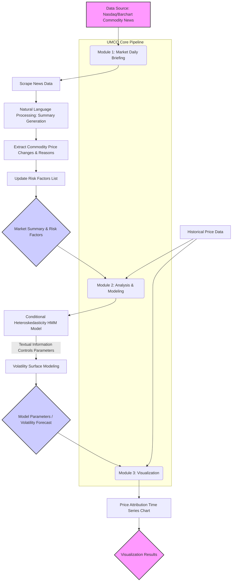

**UMCO is an innovative project combining Natural Language Processing and time series models to summarize the causes of and predict volatility for commodities (e.g., gold, oil).**

This project analyzes daily market news, extracts key information, and integrates it into sophisticated financial models to provide users with deep market insights and potential risk warnings.

---

## Project Workflow

The UMCO project achieves its functionality through the following workflow:

---

## Project Modules Explained

UMCO consists of three core modules:

### 1. Market Daily Briefing

This module serves as the project's data input and initial analysis layer.

*   **Functionality**:
    *   Automatically scrapes daily commodity-related news from sources like Nasdaq and Barchart.
    *   Utilizes Natural Language Processing (NLP) techniques to analyze and summarize news content, e.g., "Stocks Finish Higher on Chip Stock Strength and Healthy US Labor Market."
    *   Generates a market summary detailing price movements of major commodities (gold, oil, etc.), and their potential underlying causes.
    *   Maintains and updates a dynamic list of "Risk Factors" reflecting current market concerns.

*   **Output**: Structured market summary text, list of risk factors.

### 2. Analysis & Modeling

This is the core analytical engine of the project, combining financial econometrics with textual information.

*   **Functionality**:
    *   Employs a **Conditional Heteroskedasticity Hidden Markov Model (HMM)** to model market volatility.
    *   A unique aspect of the model is that its state transition probabilities or heteroskedasticity parameters are dynamically influenced by **textual information extracted from Module 1** (e.g., market sentiment, frequency of specific risk factor mentions).
    *   Models the market Volatility Surface, capturing the complex behavior of volatility under different conditions.

  <iframe src="module2_showcase.html" width="100%" height="100%" frameborder="0">
    Your browser does not support iframes. Please <a href="module2_showcase.html">click here to view the content</a>.
  </iframe>

### 3. Visualization Module

This module is responsible for presenting the complex model outputs and data analysis results in an intuitive manner.

*   **Functionality**:
    *   Generates price attribution time series charts.
    *   Clearly displays the relationship between commodity price fluctuations and various driving factors (including events extracted from news and risk factors identified by the model).
    *   Helps users understand how specific market events impact price dynamics.

  <iframe src="module3_showcase.html" width="100%" height="100%" frameborder="0">
    Your browser does not support iframes. Please <a href="module3_showcase.html">click here to view the content</a>.
  </iframe>

<!-- ## How to Run (Example)

1.  Clone the repository: `git clone https://github.com/your-username/UMCO.git`
2.  Navigate to the project directory: `cd UMCO`
3.  Install dependencies: `pip install -r requirements.txt`
4.  (Add more running instructions here...)

---

## Contributing

Contributions of all kinds are welcome! Please read `CONTRIBUTING.md` (if created) for more information. -->

---

## License

This project is licensed under the [MIT License](LICENSE).