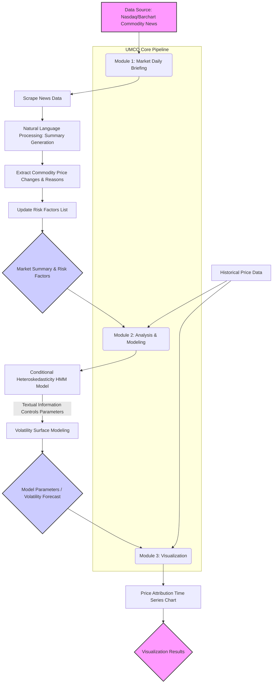

Okay, here's the plan for your "Unfilled Market Concern Output (UMCO)" project showcase page, designed for GitHub Pages, presented in English.

---

## 1. Suggested GitHub Repository Structure

To clearly organize your project and facilitate GitHub Pages deployment, consider the following structure:

```
UMCO/
├── .github/
│   └── workflows/
│       └── deploy-gh-pages.yml  # (Optional) GitHub Actions script for automated deployment
├── docs/                          # (Recommended) Source folder for GitHub Pages content
│   ├── index.md                   # Your project's main page (or README.md copied/renamed)
│   ├── _config.yml                # Jekyll configuration file (if using a Jekyll theme)
│   ├── assets/
│   │   ├── images/                # Store images (e.g., logo, screenshots)
│   │   └── css/                   # Custom styles (optional)
│   │       └── style.css
│   ├── module2_showcase.html      # Your Module 2 HTML showcase file
│   └── module3_showcase.html      # Your Module 3 HTML showcase file
├── src/                           # Project source code
│   ├── data_collection/           # Module 1: Data scraping scripts
│   ├── nlp_processing/            # Module 1: Natural Language Processing scripts
│   ├── modeling/                  # Module 2: Analysis and modeling scripts
│   ├── visualization_scripts/     # Module 3: Visualization generation scripts (if HTML is dynamically generated)
│   └── main.py                    # Main execution script (optional)
├── data/                          # (Optional) Store sample data or small datasets
│   ├── raw_data/
│   └── processed_data/
├── notebooks/                     # (Optional) Jupyter Notebooks for exploratory analysis and experiments
├── requirements.txt               # Python dependencies
├── LICENSE                        # Project license (e.g., MIT, Apache 2.0)
└── README.md                      # README in the repository root, can be similar to docs/index.md or more developer-focused
```

**Explanation:**

*   **`docs/` folder**: GitHub Pages can be configured to serve from the `/docs` folder on the `main` branch. This is a recommended practice to keep the repository root clean.
*   **`module2_showcase.html` and `module3_showcase.html`**: Place your existing HTML files in the `docs/` directory for easy embedding in the main page via `<iframe>`.
*   **`src/`**: Contains the core code, organized by module.

---

## 2. Project Flowchart

Here's a flowchart created using Mermaid syntax. You can paste this code directly into your Markdown file, and GitHub will render it.



---

## 3. GitHub Pages Content (`docs/index.md`)

```markdown
# Unfilled Market Concern Output (UMCO)

**UMCO is an innovative project combining Natural Language Processing and time series models to summarize the causes of and predict volatility for commodities (e.g., gold, oil).**

This project analyzes daily market news, extracts key information, and integrates it into sophisticated financial models to provide users with deep market insights and potential risk warnings.

---

## Project Workflow

The UMCO project achieves its functionality through the following workflow:


---

## Project Modules Explained

UMCO consists of three core modules:

### 1. Market Daily Briefing

This module serves as the project's data input and initial analysis layer.

*   **Functionality**:
    *   Automatically scrapes daily commodity-related news from sources like Nasdaq and Barchart.
    *   Utilizes Natural Language Processing (NLP) techniques to analyze and summarize news content, e.g., "Stocks Finish Higher on Chip Stock Strength and Healthy US Labor Market."
    *   Generates a market summary detailing price movements of major commodities (gold, oil, etc.), and their potential underlying causes.
    *   Maintains and updates a dynamic list of "Risk Factors" reflecting current market concerns.
*   **Example Tech Stack**: Python (Requests, BeautifulSoup/Scrapy for scraping), NLTK/spaCy/Transformers (for NLP).
*   **Output**: Structured market summary text, list of risk factors.

### 2. Analysis & Modeling

This is the core analytical engine of the project, combining financial econometrics with textual information.

*   **Functionality**:
    *   Employs a **Conditional Heteroskedasticity Hidden Markov Model (HMM)** to model market volatility.
    *   A unique aspect of the model is that its state transition probabilities or heteroskedasticity parameters are dynamically influenced by **textual information extracted from Module 1** (e.g., market sentiment, frequency of specific risk factor mentions).
    *   Models the market Volatility Surface, capturing the complex behavior of volatility under different conditions.
*   **General Formula Example (for the conditional heteroskedasticity part, e.g., GARCH(1,1) within an HMM state S_t)**:
    Within a given state *s<sub>t</sub>* of the Hidden Markov Model, the conditional variance *σ<sub>t</sub><sup>2</sup>* of returns *r<sub>t</sub>* can be expressed as:
    *r<sub>t</sub> = μ<sub>s<sub>t</sub></sub> + ε<sub>t</sub>*
    *ε<sub>t</sub> = σ<sub>t</sub> z<sub>t</sub>*,  where *z<sub>t</sub> ~ N(0,1)* (or other distribution)
    *σ<sub>t</sub><sup>2</sup> = ω<sub>s<sub>t</sub></sub> + α<sub>s<sub>t</sub></sub> ε<sub>t-1</sub><sup>2</sup> + β<sub>s<sub>t</sub></sub> σ<sub>t-1</sub><sup>2</sup>*
    Where:
        *   *μ<sub>s<sub>t</sub></sub>* is the expected return in state *s<sub>t</sub>*.
        *   *ω<sub>s<sub>t</sub></sub>, α<sub>s<sub>t</sub></sub>, β<sub>s<sub>t</sub></sub>* are the GARCH model parameters, which can vary across different states *s<sub>t</sub>*.
        *   **Key Innovation**: These parameters *ω, α, β*, or the HMM's state transition probabilities, can be further modeled as functions of textual features *T<sub>t-1</sub>* (e.g., sentiment scores, specific keyword frequencies) extracted from Module 1:
            *e.g., ω<sub>s<sub>t</sub></sub> = f(T<sub>t-1</sub>)*
*   **Module Showcase**: An interactive HTML output example for this module is embedded in the section below.

<div id="module2-container" style="width:100%; height:400px; border:1px solid #ccc; overflow:auto; margin-bottom:20px;">
  <iframe src="module2_showcase.html" width="100%" height="100%" frameborder="0">
    Your browser does not support iframes. Please <a href="module2_showcase.html">click here to view the content</a>.
  </iframe>
</div>

### 3. Visualization Module

This module is responsible for presenting the complex model outputs and data analysis results in an intuitive manner.

*   **Functionality**:
    *   Generates price attribution time series charts.
    *   Clearly displays the relationship between commodity price fluctuations and various driving factors (including events extracted from news and risk factors identified by the model).
    *   Helps users understand how specific market events impact price dynamics.
*   **Module Showcase**: An interactive HTML output example for this module is embedded in the section below.

<div id="module3-container" style="width:100%; height:400px; border:1px solid #ccc; overflow:auto;">
  <iframe src="module3_showcase.html" width="100%" height="100%" frameborder="0">
    Your browser does not support iframes. Please <a href="module3_showcase.html">click here to view the content</a>.
  </iframe>
</div>

---

## Technology Stack (Example)

*   **Programming Language**: Python
*   **Data Processing & Analysis**: Pandas, NumPy, SciPy, Statsmodels
*   **Natural Language Processing**: NLTK, spaCy, Transformers (Hugging Face)
*   **Machine Learning / Deep Learning**: Scikit-learn, TensorFlow/Keras, PyTorch (for HMM or NLP models)
*   **Web Scraping**: Requests, BeautifulSoup, Scrapy
*   **Visualization**: Matplotlib, Seaborn, Plotly, Bokeh (for generating HTML charts)
*   **Web Framework (Optional, for API)**: Flask, FastAPI

---

## How to Run (Example)

1.  Clone the repository: `git clone https://github.com/your-username/UMCO.git`
2.  Navigate to the project directory: `cd UMCO`
3.  Install dependencies: `pip install -r requirements.txt`
4.  (Add more running instructions here...)

---

## Contributing

Contributions of all kinds are welcome! Please read `CONTRIBUTING.md` (if created) for more information.

---

## License

This project is licensed under the [MIT License](LICENSE).

```

**Instructions for Use:**

1.  **Create `docs/index.md`**: Paste the Markdown content above into the `docs/index.md` file in your repository.
2.  **Place HTML Files**: Also, place your `module2_showcase.html` and `module3_showcase.html` files in the `docs/` folder. If your filenames are different, update the `src` path in the `<iframe>` tags.
3.  **GitHub Pages Setup**:
    *   Go to your GitHub repository -> Settings -> Pages.
    *   Under "Build and deployment," for "Source," select "Deploy from a branch."
    *   For "Branch," select `main` (or your primary branch) and the `/docs` folder.
    *   Click "Save." GitHub Actions will start building your page, and it should be accessible after a few minutes.
4.  **Custom Styling (Optional)**: You can add custom CSS rules in `docs/assets/css/style.css` to beautify the page and reference it in `_config.yml` (if using Jekyll) or directly in your HTML/Markdown.
5.  **Images**: If you have a project logo or other relevant images, place them in the `docs/assets/images/` directory and reference them in Markdown using a relative path, e.g., ``.

This plan provides a well-structured and informative starting point for your project's showcase page. You can further refine it based on the specific progress and details of your project.